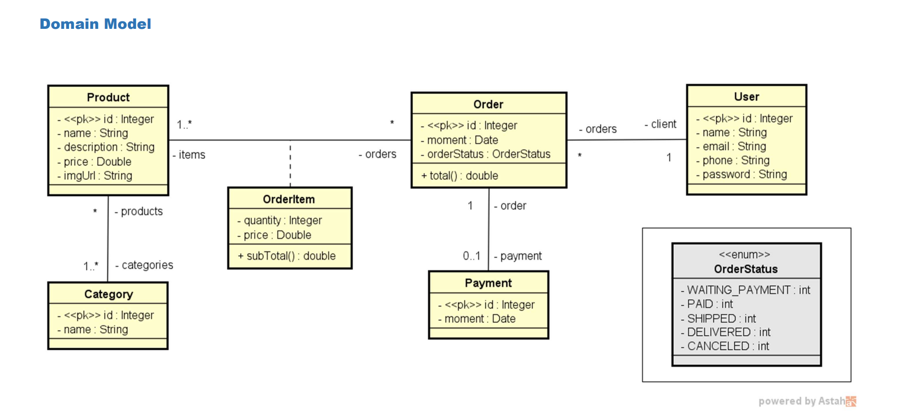

# 🛒 E-Commerce API com Autenticação JWT

API RESTful desenvolvida em **Java** para gerenciamento de pedidos, produtos, categorias e usuários, com **autenticação segura via JWT**.  
Ideal para aplicações de e-commerce, catálogos de produtos ou sistemas de pedidos personalizados.

---

## 📌 Funcionalidades

- Cadastro de usuários (com autenticação JWT)
- Login e geração de token JWT
- Registro de pedidos com múltiplos produtos
- Gerenciamento de categorias e produtos
- Associações entre pedidos, itens, pagamento e usuário
- Cálculo automático de subtotal e total dos pedidos
- Enum `OrderStatus` para controle do ciclo de vida dos pedidos

---

## 🧠 Diagrama de Domínio

> Esse diagrama mostra a modelagem das entidades e os relacionamentos do sistema:

---

## 🔐 Autenticação JWT

O projeto implementa segurança via **JWT (JSON Web Token)**, permitindo:

- Login com credenciais
- Geração de token JWT válido
- Proteção de rotas (ex: `/orders`, `/products`) com middleware JWT
- Expiração e validação de token

---

## 🛠 Tecnologias Utilizadas

- Java 21
- Spring Boot
- Spring Security
- JWT (jjwt)
- JPA / Hibernate
- Banco de dados relacional (H2, PostgreSQL ou MySQL)
- Lombok
